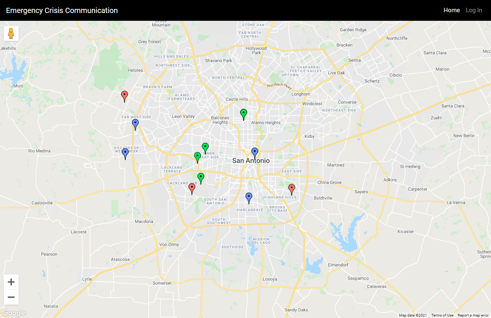
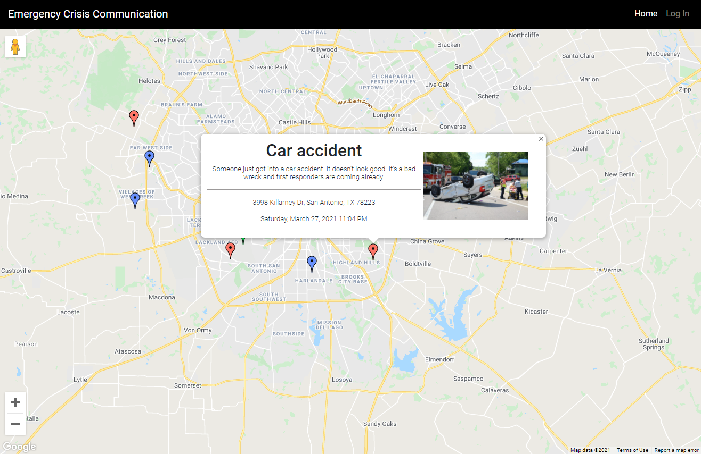

# Emergency Crisis Communication (EmCom)

**What is is**
---
EmCom is a software that allows communities to post information, request aid, and list emergencies in a time of crisis

**Acess**
---
To access a live version of the software, please visit [24.175.90.130](http://24.175.90.130:3000)
